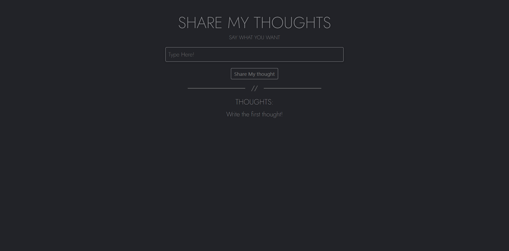
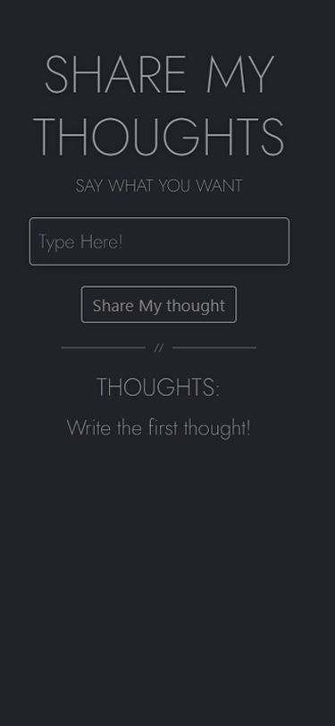

<h1 align="center">
    
</h1>

<h2 align="center">Say what you want!</h2>

## 👨‍💻 Technologies

- [Node.js]
- [Express]
- [Axios]
- [Nunjucks]


## 🔧 Resources
* Share your Thoughts

## ❓ How to use?

### Installation

```bash
$ cd SHARE-MY-THOUGHTS
$ npm install
$ npm start
```

## 💻 Web View

<h1 align="center">
    
</h1>

## 📱 Mobile View

<h1 align="center">
    
</h1>

<br>

<p align="center">
Created by Bruno Lemos.
</p>
